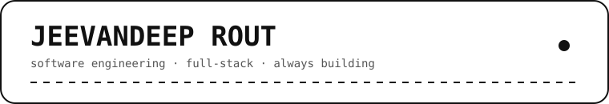

 

 

<a href="https://github.com/JeevandeepRout">GitHub</a> ·
<a href="https://www.linkedin.com/in/jeevandeeprout">LinkedIn</a> ·
<a href="mailto:jeevandeeprout07@gmail.com">Email</a>

 

 

I'm a Computer Science engineering student who enjoys turning ideas into practical software.

I like building full-stack applications, learning how systems work under the hood, and polishing small details until a project feels complete.

Currently focused on **software engineering, backend development, databases, and building projects worth showing.**

**Languages**  
`C` · `C++` · `Java` · `Python` · `SQL`

**Web & Backend**  
`HTML` · `CSS` · `JavaScript` · `React` · `Next.js` · `Node.js`

**Data & Tools**  
`MongoDB` · `Git` · `GitHub` · `Bootstrap`

| Project | What it is |
|---|---|
| **Full-Stack Authentication** | Authentication flow with signup, login, protected profile access, MongoDB and Next.js. |
| **Finance Tracker** | A practical full-stack application for tracking expenses, balances and financial activity. |
| **Teacher Dashboard** | A management platform for attendance, quizzes, assignments and student statistics. |
| **Weather App** | A responsive weather application powered by a weather API. |

 

Stats and graphics are regenerated automatically once a day. Only changed generated files are committed.

