<picture>
  <source media="(prefers-color-scheme: dark)" srcset="https://raw.githubusercontent.com/abozanona/abozanona/output/pacman-contribution-graph-dark.svg">
  <source media="(prefers-color-scheme: light)" srcset="https://raw.githubusercontent.com/abozanona/abozanona/output/pacman-contribution-graph.svg">
  
</picture>

<!--Header-->
<div align="center">

<h1>
<a href="https://git.io/typing-svg"></a>
</h1>

[LinkedIn](https://linkedin.com/in/jeevandeeprout) &nbsp;·&nbsp;
[GitHub](https://github.com/JeevandeepRout) &nbsp;·&nbsp;
[email](mailto:jeevandeeprout07@gmail.com) 

</div>

<br/>

<!--About-->


> CS student at Institute of Technical Education and Research · SOA , Odisha, India.<br>
> Build things worth remembering.

I'm a developer who enjoys turning ideas into practical software, with a focus on **full-stack development, backend systems, and problem-solving**. I'm currently sharpening my **DSA and system design skills** while building projects with **JavaScript, Python, Java, React, Next.js, Node.js, and MongoDB**.

Outside of code, I'm usually **gaming, watching movies or anime, or exploring something new in tech**. Based in **Odisha, India**, and always looking for the next thing to build, break, and understand.


<br/>

<!--Stack-->


```yaml
⌬ Languages: C · C++ · Java · Python · JavaScript · TypeScript
⌬ Frameworks: React · Next.js · Node.js · Express.js
⌬ Web: HTML · CSS
⌬ Database: MongoDB · MySQL
⌬ Tools: Git · GitHub · VS Code · Ubuntu
```

<!--Projects-->


**[Full-Stack Authentication System]()** &nbsp;·&nbsp; <samp>next.js, mongodb</samp><br>
Secure authentication system with signup, login, protected routes, and user profiles.<br>
Built to explore full-stack authentication and session-based access control.

**[Weather Dashboard](https://github.com/JeevandeepRout/Multi-City-Weather-Dashboard)** &nbsp;·&nbsp; <samp>javascript, api, html, css</samp><br>
Real-time weather application powered by the OpenWeatherMap API.<br>
Search cities, view current conditions, and explore weather data through a clean interface.

**[Expense Tracker](https://github.com/JeevandeepRout/Expense-Tracker)** &nbsp;·&nbsp; <samp>react, javascript, css</samp><br>
Simple expense management app for tracking income and spending<br>
Built with a focus on clean UI, practical state management, and everyday usability.


<!--Stats-->


<div align="center">
  
  <br/><br/>
  
  <br/><br/>
  
  <br/><br/>
  
</div>


<br/>


<!--Thoughts-Things-->


> [!NOTE]
> **🚀 Current Status**
>
> Building **real-world full-stack projects** · Learning **modern web technologies** · Exploring **backend & system design** · Growing into a **better software engineer**

<br/>

<div align="center">
<!--luffy-->
  

<sub>headers and stats above are generated locally and refreshed daily — see <a href="SETUP.md">SETUP.md</a></sub>

</div>

<div align="center">
  
</div>
